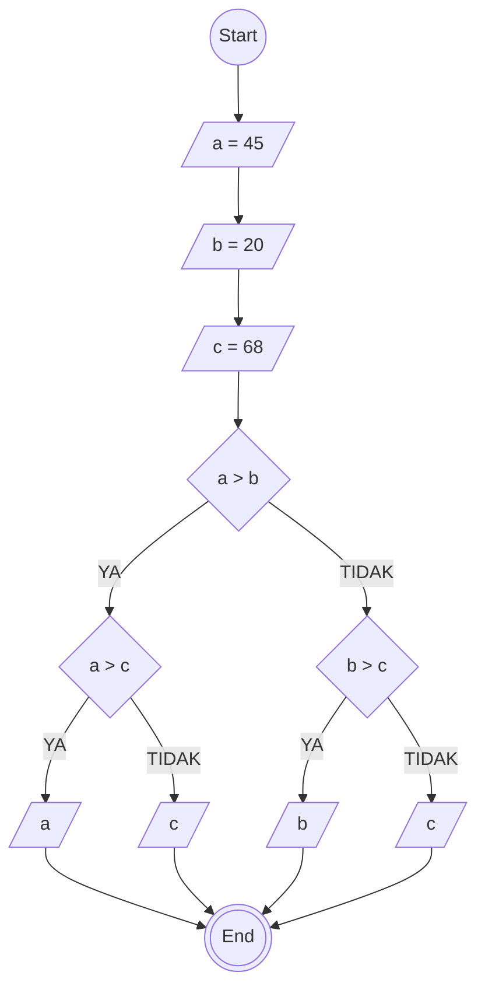
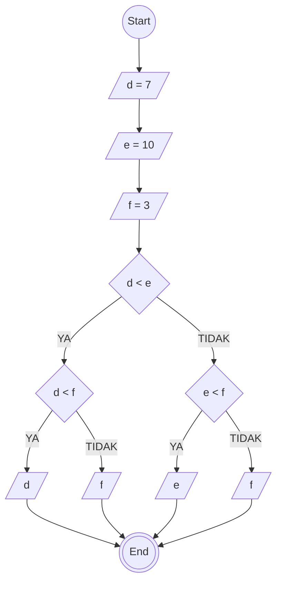
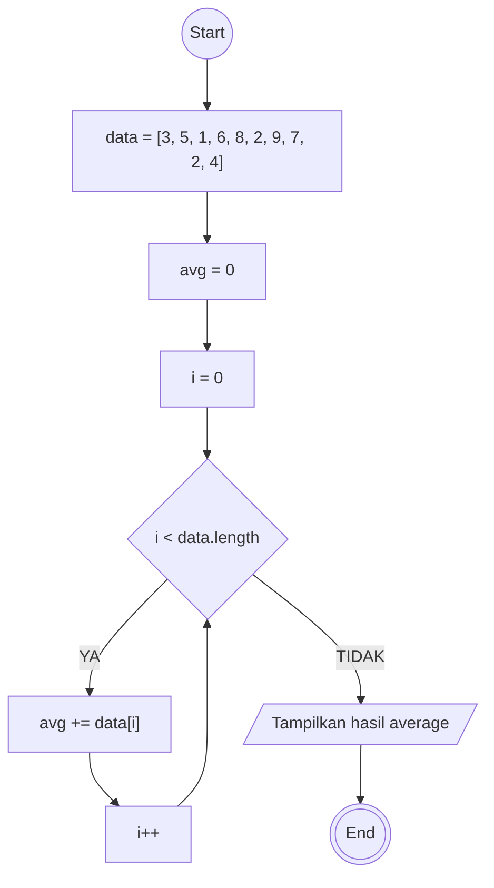

## Flowchart JavaScript 2 Minitask 1

### Flowchart Max

```mermaid
flowchart TD
  start((Start))
  a[/a = 45/]
  b[/b = 20/]
  c[/c = 68/]
  if1{a > b}
  if2{a > c}
  out1[/a/]
  out2[/c/]
  if3{b > c}
  out3[/b/]
  out4[/c/]
  finish(((End)))

  start --> a --> b --> c --> if1
  if1 -- YA --> if2
  if1 -- TIDAK --> if3
  if2 -- YA --> out1
  if2 -- TIDAK --> out2 
  if3 -- YA --> out3
  if3 -- TIDAK --> out4 

  out1 --> finish
  out2 --> finish
  out3 --> finish
  out4 --> finish
```

### Flowchart Min

```mermaid
flowchart TD
  start((Start))
  d[/d = 7/]
  e[/e = 10/]
  f[/f = 3/]
  if1{d < e}
  if2{d < f}
  out1[/d/]
  out2[/f/]
  if3{e < f}
  out3[/e/]
  out4[/f/]
  finish(((End)))

  start --> d --> e --> f --> if1
  if1 -- YA --> if2
  if1 -- TIDAK --> if3
  if2 -- YA --> out1
  if2 -- TIDAK --> out2 
  if3 -- YA --> out3
  if3 -- TIDAK --> out4 

  out1 --> finish
  out2 --> finish
  out3 --> finish
  out4 --> finish
```

### Flowchart Average

```mermaid
flowchart TD
  start((Start))
  data["data = [3, 5, 1, 6, 8, 2, 9, 7, 2, 4]"]
  avgInit[avg = 0]
  init[i = 0]
  for{i < data.length}
  avg["avg += data[i]"]
  inc[i++]
  out[/Tampilkan hasil average/]
  finish(((End)))

  start --> data --> avgInit --> init --> for
  for -- YA --> avg
  for -- TIDAK --> out
  avg --> inc --> for

  out --> finish
```