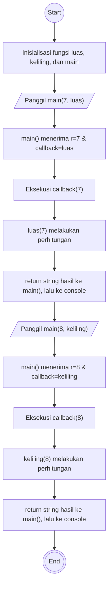

## Penjelasan dan Flowchart Minitask 4
### Penjelasan
```
1. Mulai
2. Program menginisialisasi fungsi luas(), keliling(), dan main().
3. Panggil console.log(main(7, luas)).
4. Passing nilai r=7 dan function luas sebagai argumen (callback).
5. Masuk ke fungsi main().
6. Fungsi main mengeksekusi callback(7), yang berarti memanggil luas(7).
7. Fungsi luas() menghitung rumus dan me-return string hasil.
8. Fungsi main() me-return hasil tersebut ke console.log untuk dicetak.
9. Panggil console.log(main(8, keliling)).
10. Passing nilai r=8 dan function keliling sebagai argumen (callback).
11. Masuk ke fungsi main().
12. Fungsi main mengeksekusi callback(8), yang berarti memanggil keliling(8).
13. Fungsi keliling() menghitung rumus dan me-return string hasil.
14. Fungsi main() me-return hasil tersebut ke console.log untuk dicetak.
15. Selesai
```

### Flowchart
